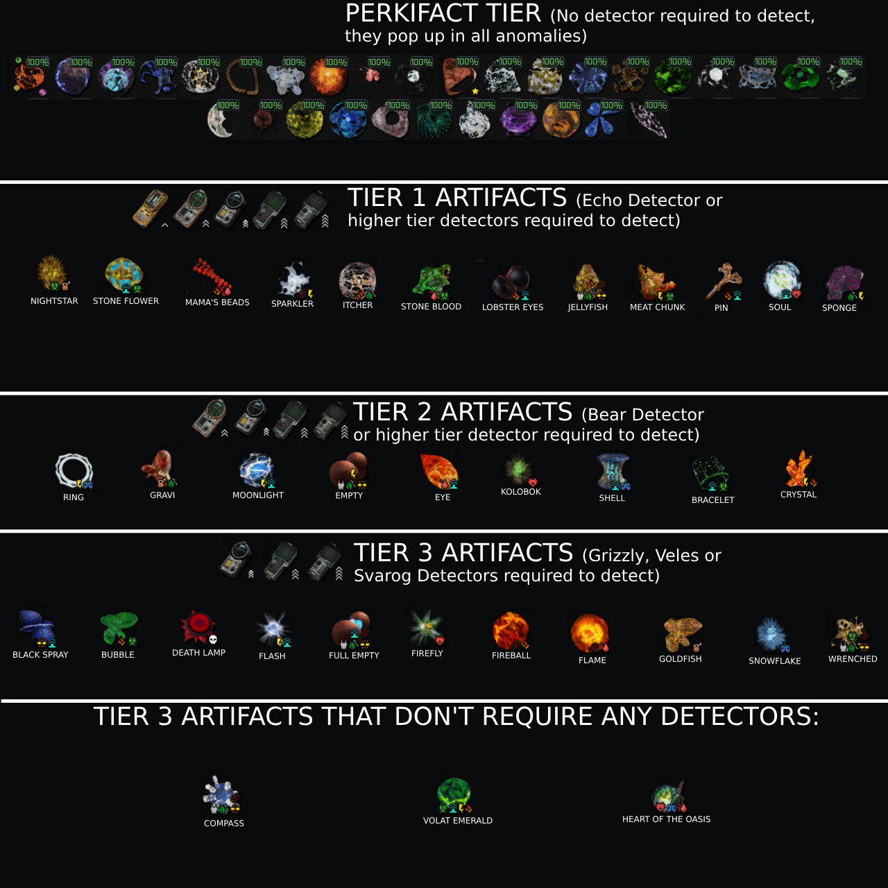
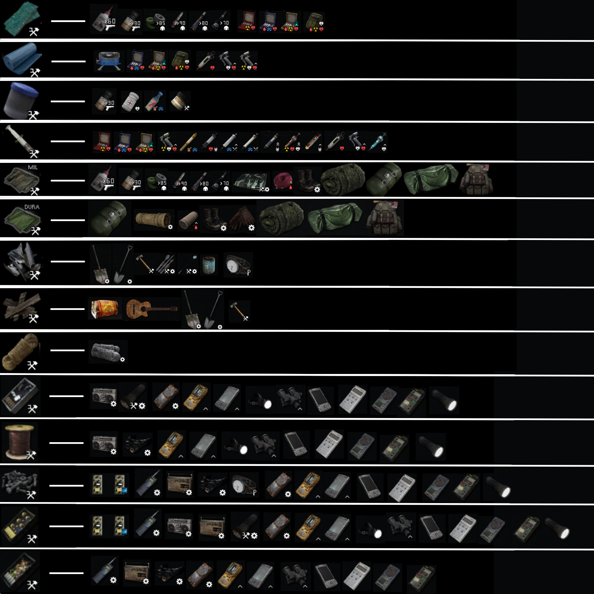

<details>
  <summary align="center">📱 Mobile / Phone (W.I.P)</summary>
  <br>


## 📥 My Tweaks (What I do after re-install)


### Install
Bitwarden  
[Aliucord](<https://github.com/Aliucord/Aliucord>)  
[NetGuard - no-root firewall](<https://forum.mobilism.org/viewtopic.php?f=428&t=5811017>) (Firewall + whitelist/blacklist apps) - Similar to [NetLimiter](<https://www.netlimiter.com/>) / [InviZible Pro: Tor & Firewall](<https://play.google.com/store/apps/details?id=pan.alexander.tordnscrypt.gp>), [2](<https://forum.mobilism.org/viewtopic.php?f=428&t=5787495>)  


### **Personal Preference**:
**Settings**: > Search: `Auto sync` > Disable it  
**Settings**: `Privacy` > Enable: `Alert when clipboard accessed`  
**Settings**: `Developer options` > Enable: `Suspend execution for cached apps`  
**Play Store**: Click icon in top-right corner > `Play Protect` and turn it all off  
**Settings**: > Search: `Device assistance app` > set `Device assistance app` to "None"  
**Settings**: Search: `Permission manager` > Remove/Limit access of everything to your liking!  
**Settings**: > `Connections` > `More Connections Settings` > `Private DNS`. Enter "dns.adguard.com", "family.adguard-dns.com"(for extra protection) or "bafcbe.dns.nextdns.io"  
**Settings**: `Connections` > `Wi-Fi` > Hit 3 dots in top-right corner > `Advanced` > Disable: `Detect suspicious networks` & `Hotspot 2.0`  
**Settings**: `About Device` > System > Tap `Build Number` 7-10 times > Go back and find `Developer Options` > `Quick settings developer tiles` > `Sensors off`  

### **Customization**:
**Install**: `GoodLock` App  
Download `Home Up` within the app (hide label names, have more app rows, task changer, etc) | 
Download `LockStart` & `Theme Park` within the app (both work together)  
Download `QuickStar` within the app (move clock location @ top + custom theme & Auto-expand notifications: [1](<https://xdaforums.com/t/auto-expand-notifications.4562939/>))  

#### **Disable**
- Bixby Routines
- Find mMY Device
- Turns off Edge panels
- Disables the app drawer 
- Limit apps and Home screen
- NFC and contactless payments
- Reduces refresh rate to 60Hz
- Limits all background activity
- Only allows selected apps (up to eight) on the Home screen
- Sets a system-wide dark theme (with a solid black wallpaper)
- Adaptive Battery (unless you use a lot... Needs to learn habits)


#### **Other / Write-ups**:
- You put some apps into Deep sleep
- Disable fast charging in settings & Turn on power saving mode (batter option?) This'll only charge it to 85%?  
- Set up a Bixby Routine so that when it's charging, Protect Battery is turned on (yes, this is now an option in Bixby Routines).
- At night when it's idling, set up a Bixby Routine to turn on Airplane mode. For example, mine is set to turn it on between 00:00 - 06:00 during work days  
- [Guide: How to increase battery life and battery health, using Lithium battery science!](<https://www.reddit.com/r/samsung/comments/pyn8n4/guide_how_to_increase_battery_life_and_battery/>)  
- [MEGA PRO TIPS - Make the most of your S10! Settings, Customization, Convenience & Battery Tips!](<https://www.reddit.com/r/galaxys10/comments/bg2bb2/mega_pro_tips_make_the_most_of_your_s10_settings/>)  


#### **Videos**:
- [Android privacy optimization guide](https://youtu.be/7sZVdoQ0NN0) - Developer mode  
- [23 Android 13 Settings You NEED To Turn Off Now](https://youtu.be/dEE7OjXeNqQ)  
- [Every Android Privacy Setting You Need To Change Now](https://youtu.be/hH7hmlEIijQ)  
- [25 hacks to fix android battery drain — #7 is a killer (#7 is Adaptive Brightness)](https://youtu.be/y5ewEJtT134) - DeArrow extension renames title  


## 📝 **Websites used / Information (useful)**:


**Modded APKs**:  
[AppDoze](<https://appdoze.com>)  
[Mobilism](<https://forum.mobilism.org>)  
[RB Community](<https://www.rockmods.net>)  
[LITEAPKS.COM](<https://liteapks.com>) - My Fav?  
[Platinmods](<https://platinmods.com/>) - Modded Games  

**Untouched APKs**:  
[APKMirror](<https://www.apkmirror.com>)  
[UpToDown - Android](<https://en.uptodown.com>)  

**Index / Other**:  
[FREEMEDIAHECKYEAH](<https://www.reddit.com/r/FREEMEDIAHECKYEAH/wiki/android>) - Reddit | android / IOS  
[Universal Android Debloater Next-Generation](<https://github.com/Universal-Debloater-Alliance/universal-android-debloater-next-generation>) - GitHub  
[How to use NetGuard + personalDNSFilter+ Any VPN, without root, without external self-hosted servers](https://itsignacioportal.github.io/netguard-pdnsf-any-vpn-combo/)  

### 💾 Apps / Downloads

#### 📌 **Important**:
[Revo Uninstaller Mobile](<https://forum.mobilism.org/viewtopic.php?f=438&t=5802580>)  
[Reddit (Premium Unlocked)](<https://liteapks.com/reddit.html>)  
[X (Twitter) (Premium Features)](<https://liteapks.com/twitter.html>)  
[Instagram (Optimized, No ADS)](<https://liteapks.com/instagram.html>)  
[Spotify: Music and Podcasts (Mod Lite)](<https://forum.mobilism.org/viewtopic.php?f=1332&t=5801165>)  
[Facebook Lite (Privacy Mod)](<https://forum.mobilism.org/viewtopic.php?f=1336&t=5809299>) - Or use Revanced?  
[YouTube ReVanced)](<https://liteapks.com/youtube-revanced-2.html>) / [YouTube Vanced](<https://liteapks.com/youtube-vanced.html>)  
[Lucky Patcher](<https://forum.mobilism.org/viewtopic.php?f=438&t=5800842>), [2](<https://liteapks.com/lucky-patcher.html>) & [revanced-manager](<https://github.com/ReVanced/revanced-manager>)  

#### 🛡️ **Security / Tracking?**:
[Anti Spy (Pro Unlocked)](<https://liteapks.com/anti-spy-4-scanner-spyware.html>)  
[CCleaner – Phone Cleaner (Pro + Mod Extras)](<https://forum.mobilism.org/viewtopic.php?f=438&t=5803381>)  
[AdGuard Ad Blocker v4.7.179 (Final, Premium, No-Root & Mod Extra)](<https://forum.mobilism.org/viewtopic.php?f=428&t=5799753&hilit=AdGuard+Ad+Blocker>), [Lite version](<https://forum.mobilism.org/viewtopic.php?f=428&t=5801145&hilit=AdGuard+Ad+Blocker>) / [Blokada](<https://blokada.org/>)  

#### 🎨 **Theme / Visuals**:
[AmoledPix (Premium Unlocked)](<https://liteapks.com/amoledpix-black-4k-wallpapers.html>)  
[Pika! Charging Show (VIP Unlocked)](<https://liteapks.com/pika-charging-show-2.html>)  
[Dynamic View (Premium Unlocked)](<https://liteapks.com/dynamic-view.html>), [2](<https://forum.mobilism.org/viewtopic.php?f=439&t=5675680>)  
[Super Status Bar (Premium + Mod Extra)](<https://forum.mobilism.org/viewtopic.php?f=439&t=5653886>)  
[Ultra Volume Control Styles (MOD + Pro Unlocked)](<https://liteapks.com/ultra-volume-control-styles.html>), [2](<https://forum.mobilism.org/viewtopic.php?f=439&t=5810470>), [Prem + Mod Extra](<https://forum.mobilism.org/viewtopic.php?f=439&t=4867270>)  
[One Shade (Pro Unlocked)](<https://liteapks.com/one-shade-2.html>), [2](<https://forum.mobilism.org/viewtopic.php?f=439&t=5809941>) / [Mi Control Center (Pro)](<https://forum.mobilism.org/viewtopic.php?f=439&t=5808346>)   
~~[Nova Launcher (Final, Prime, UltraLite & Extra Customizable)](<https://forum.mobilism.org/viewtopic.php?f=439&t=5480092>) / [Smart Launcher 6 (Pro + Mod Extra)](<https://forum.mobilism.org/viewtopic.php?f=439&t=5804979>)~~  
**Icons**:  
[Icon Pack Studio v2.2 (Unrestricted + Premium)](<https://forum.mobilism.org/viewtopic.php?f=1064&t=5742272>) - Use `Theme Park` to apply the icons  
[Moxy Icon Pack (Full Version)](<https://liteapks.com/moxy-icon-pack.html>)  
[Super Icon Pack (Full Version)](<https://liteapks.com/super-icon-pack.html>)  
[Ciclo - Icon Pack (Full Version)](<https://liteapks.com/ciclo-icon-pack.html>)  
[Glassify Icon Pack (Full Version)](<https://liteapks.com/glassify-icon-pack.html>)  
[Darko - Icon Pack (Full Version)](<https://liteapks.com/darko-icon-pack.html>)  
[Bladient Icon Pack (Full Version)](<https://liteapks.com/bladient-icon-pack.html>)  
[Vera Icon Pack APK (Full Version)](<https://liteapks.com/vera-icon-pack.html>)   
[Supreme Icon Pack (Full Version)](<https://liteapks.com/supreme-icon-pack.html>)  
[Nova Dark Icon Pack (Full Version)](<https://liteapks.com/nova-dark-icon-pack.html>)  
[SuperBlack Icon Pack (Full Version)](<https://liteapks.com/superblack-icon-pack.html>)  
[Baked Dark Icon Pack (Full Version)](<https://liteapks.com/baked-dark-icon-pack.html>)  
[Vera Outline Icon Pack (Full Version)](<https://liteapks.com/vera-outline-icon-pack.html>)  
[PixxR Buttons Icon Pack (Full Version)](<https://liteapks.com/pixxr-buttons-icon-pack.html>)  
[Layers - Glass Icon Pack (Full Version)](<https://liteapks.com/layers-glass-icon-pack.html>)  
[Hera Dark: Circle Icon Pack (Full Version)](<https://liteapks.com/hera-dark-circle-icon-pack.html>)  
[iDarkOS 18 - Icon Pack APK (Full Version)](<https://liteapks.com/idarkos-18-icon-pack.html>), [2](<https://forum.mobilism.org/viewtopic.php?f=1064&t=5692098>)  


#### ⚙️ **Mobile Apps / Tweaks**:
[TickTick:To-do list & Tasks (Pro + Mod Extra) ](<https://forum.mobilism.org/viewtopic.php?f=432&t=5803384>)  
[Zedge Wallpapers & Ringtones (Final + Subscribed)](<https://forum.mobilism.org/viewtopic.php?f=1064&t=5803273>)  
[Easy Notes (VIP Unlocked)](<https://liteapks.com/easy-notes-2.html>) , [2](<https://forum.mobilism.org/viewtopic.php?f=432&t=5775379>) / [Teka Notes - Notepad (Premium)](<https://forum.mobilism.org/viewtopic.php?f=432&t=5808704>) | [UpNote - notes, diary, journal (Premium)](<https://forum.mobilism.org/viewtopic.php?f=432&t=5811052>) - UpNote has desktop app (sync?)  

#### 🔧 **Utility**:
[Multiple Accounts (VIP Unlocked)](<https://liteapks.com/multiple-accounts.html>)  
[Melodi - Poweramp v3 Skin (Paid)](<https://forum.mobilism.org/viewtopic.php?f=1064&t=5809989>)  
[App Usage - Manage/Track Usage (Pro + Mod Extra)](<https://forum.mobilism.org/viewtopic.php?f=438&t=5591567>), [2](<https://liteapks.com/app-usage.html>)  
[All Backup & Restore (Pro Unlocked)](<https://liteapks.com/all-backup-restore.html>) / [Swift Backup (Premium Unlocked)](<https://liteapks.com/swift-backup.html>), [2](<https://forum.mobilism.org/viewtopic.php?f=438&t=5807659>), [3](<https://forum.mobilism.org/viewtopic.php?f=438&t=5777066>)  
[Button Mapper: Remap your keys (Pro + Altered)](<https://forum.mobilism.org/viewtopic.php?f=438&t=5764369>) - Single press, Double press and hold press of phone buttons mapping.  

#### ➕ **Other**:
[TimeBlocks (Premium Unlocked)](<https://liteapks.com/timeblocks.html>)  
[StandBy Mode Pro (Premium Unlocked)](<https://liteapks.com/standby-mode-pro.html>)  
[Pujie Black APK (Full Version)](<https://liteapks.com/pujie-black.html>) - Smart Watches  
[AI Chat 4o (Chat GPT) (Premium Unlocked)](<https://liteapks.com/chat-gdt-2.html>)  
[Offline Map Navigation (Premium Unlocked)](<https://liteapks.com/offline-map-navigation.html>)  
[Alarmy - Alarm Clock & Sleep (Premium Unlocked)](<https://liteapks.com/alarmy-alarm-clock-solution.html>)  
[NexBot AI (Premium Unlocked)](<https://liteapks.com/nexbot-ai.html>) - Best for everything? (Quill + ProWritingAid)  
[FUTO Keyboard](<https://keyboard.futo.org/>) - Keyboard  
[Stylish Text Fonts & Keyboard (Premium Unlocked)](<https://liteapks.com/stylish-text-fonts-keyboard.html>) - Keyboard  
[Microsoft SwiftKey AI Keyboard (Final + Mod)](<https://forum.mobilism.org/viewtopic.php?f=426&t=5445309>) - EXTREMELY recommended...  
[Grammarly Keyboard (Premium Unlocked)](<https://liteapks.com/grammarly-keyboard-3.html>) - Not trustworthy as it uploads everything you type but might be a fun test?  
[Nebulo - DNS Changer DoH/DoT](<https://play.google.com/store/apps/details?id=com.frostnerd.smokescreen>) - Recommended  

#### **Custom ROMs / OS**:
[Magisk](<https://github.com/topjohnwu/Magisk>)  
[EdXposed](<https://github.com/ElderDrivers/EdXposed>) & [ZygiskNext](<https://github.com/Dr-TSNG/ZygiskNext>) - [1](<https://www.reddit.com/r/androidroot/comments/17og97c/need_help_with_xposed_framework/k7yiwi5/>)  

#### 🎮 **Games**:
[Minecraft (Paid + Patched)](<https://forum.mobilism.org/viewtopic.php?f=447&t=5800656>)  
[Subway Surfers City (Menu, Unlimited Coins, Keys, Revives)](<https://liteapks.com/subway-surfers-city.html>)  

#### 🌱 **Root REQUIRED**:
[AFWall+](<https://github.com/ukanth/afwall>), [2](<https://forum.mobilism.org/viewtopic.php?f=428&t=5364989>)  
[Folder Widget - Large Folders (Pro + Root)](<https://forum.mobilism.org/viewtopic.php?f=439&t=5663682>)  
[AdAway](<https://github.com/AdAway/AdAway>) - Widely used + recommended (Use with host file for BEST ad blocking experience across the WHOLE phone) | [1](<https://www.reddit.com/r/fossdroid/comments/1agzdyv/adaway_what_is_it_blocking/komllne/>)  
[I root for](https://www.reddit.com/r/Android/comments/kogzrt/is_rooting_still_worth_the_effort_in_2021/ghrc3zk/), [2](https://www.reddit.com/r/androidroot/comments/17uycnw/what_are_the_benefits_of_rooting_android_in_2023/k96ytqo/), [3](<https://www.reddit.com/r/Android/comments/96r4qz/is_rooting_your_device_still_worth_it/e42umay/>):  
- Adaway
- Adds removal without using vpn
- Call recording (I use skvalex with the Magisk module)
- Titanium backup & restore - (getting less important as more app details are synced in the cloud) - also for debloat by freezing system junk
- Battery Charge Limit
- Greenify
- Island for 2 whatsapp accounts on one phone
- Amplify to reduce wakelocks
- Root features of Notification Center for Pebble
- Uninstall/disable bloatware
- Full app backup and restore with Swift Backup
- root browser (I use Solid Explorer)
- Viper4android for audio tweaks
- Kernel Audiutor to tweak performance + good battery
- Custom boot animation's
I never use custom roms anymore. I like Motorola phones and their stock ROMs are pretty decent. Also I have had a lot of trouble with mobile networks on custom ROMS - VOLTE stops working and other bugs.  


</details>


<details>
  <summary align="center">🎮 Stalker G.A.M.M.A list of mods, information + other basics</summary>
  <br>


[🔎 Takes you to Tweaks section](https://github.com/misspent/Random-Stuff?tab=readme-ov-file#-tweaks)  
[📥 Takes you to Mods installed section](https://github.com/misspent/Random-Stuff?tab=readme-ov-file#-mods-ive-installed--list-order-is-proper-order-in-mo)

### **📌 Stalker G.A.M.M.A Information - [Join Discord server](https://discord.gg/stalker-gamma)**  

**⚙️ Go into GAMMA Discord channel bot-commands and type**:  
`!update` - How to update  
`!fps` - Get an FPS counter  
`!reshade` - Get reshade back  
`!dof` - Disable Depth of Filed  
`!debug` - Enable Debug mode  
`!shader` - Delete Shader_Cache  
`!inspect` - Manually inspect your gun  
`!buyammo` - Where and how to buy ammo  
`!minimap` - Change minimap style/position  
`!shit` - All spreadsheet links in one message  
`!basic` - All types of ways to get basic tool kit  
`!v6` - Update G.A.M.M.A Launcher to its most recent version  
`!tools` - Chart of drop chance based on area and tier of tools  
`!whatthegundoin` - Shows you what each stats / upgrade means?  
`!backup` - Backup of your keybinds, settings and Mod Organizer profile  
`!factions` - To unlock every faction from the beginning, you can type `greh`/`renegades`/`isg`/`z`  
`!dxvk` - Optimize the game with up-to-date dll files, etc... More testing required so this is TEMP (I'm on v2.3) | Do `!k98` to undo?  

Tips & Tricks Playlist: https://www.youtube.com/watch?v=81IXxI2OI9w&list=PL_OIXNKBvhGAZliyCRMHD6cTHkD-bZX9c  

---


### **ℹ️ MORE INFORMATION**:  
- [Weapon Chart](<https://docs.google.com/spreadsheets/d/1sOtZAVmTUP8Mc387xSEHlFcPqg1CtT1YgQmxu6Xlz6M>)
- [Nimble weapons trade](<https://docs.google.com/spreadsheets/d/1lKlMGe56ep1c-mzt19WoHr_BfulFr3Fn6AQGDr-v3tM>)
- [Aslan Lottery Outcomes](<https://docs.google.com/spreadsheets/d/1Ocz6SF8KT0DVYTy7gkH6FYX9bd-IwbW8ONbb6IGmc0c>)  
- [Gamma Reshade Database](<https://docs.google.com/spreadsheets/d/1psiAYFNaGSYs2j5Gbd6p67SyVi6PQvhr9vSUOiyFATw>)
- [Drugs crafting spreadsheet](<https://docs.google.com/spreadsheets/d/1UXTQRwq6qKE-EgoVb-f0dDxRk45ujQs2XRPgFv_x9R4>)
- [Storyline Progression Guides](<https://docs.google.com/spreadsheets/d/1ltWH1CUjjv7KG2lzS0HY4YtQqs7nsW82CilzAULjJdw>)
- [RF packages spawning points](<https://docs.google.com/spreadsheets/d/1mDAAm9izEtoeDRsKjsYpL0hSbcjWz-AgdIg0DSogPeM>)
- [Stash Tier chance by Location](<https://docs.google.com/spreadsheets/d/1YJUwO5sAnzh3UFWZJS82oz6_QTkmcnBBJDpFnG_XIro>)  
- [G.A.M.M.A. RF Package Locations](<https://docs.google.com/spreadsheets/d/1mDAAm9izEtoeDRsKjsYpL0hSbcjWz-AgdIg0DSogPeM>)
- [UPDATED GAMMA Weapon Database](<https://drive.google.com/file/d/1mNqIq0TgHX0CaIpUZ4e5MgMIKoIHlhTs>)
- [Zone Handbook (contains a lot of good guides)](<https://docs.google.com/spreadsheets/d/17ZLrcwv-5aFjusQ6yKdHrBkq0fiPRBCvdCnzrvpz-Y0>)
- [Weapons + Armours + Mutants + Artifacts + Food + Drinks + Medicines + etc.](<https://docs.google.com/spreadsheets/d/1OWE25Go9kSao5-IDOS4ZWkBtLfyEF_hPLJz7QQR2lqY>)
- [Link to all spreadsheets in the discord server](https://discord.com/channels/912320241713958912/976570969768476753/1109969814388215889) / do `!SHIT` in bot-commands

### **Other**:

- Keep backups of `Anomaly/appdata/user.ltx`, `G.A.M.M.A. MCM values` & `G.A.M.M.A\overwrite\bin\reshade.ini` which is where all in-game settings, reshade settings + keybinds are stored (I've made a .bat for this)
- Check pins in all chats in G.A.M.M.A discord (especially newbies-chat)

#### Reposition weapons (in debug mode?)
- [HUD Offsets Editor](https://www.moddb.com/mods/stalker-anomaly/addons/hud-offsets-editor1)
- [Draggable Hud Editor (UPDATE 9)](https://www.moddb.com/mods/stalker-anomaly/addons/draggable-hud-editor)

This is how `skilldex` from G.A.M.M.A discord server does it (he has ultra wide)

> I've not encountered anything strange, irritating, or buggy with all these mods so far; if I do, then I'll more than likely test and find the issue, but for now it's good to go (imo). Fingers crossed, aye?

---


### **🔎 Tweaks**

**Disable the following**:  

- `G.A.M.M.A. NPC Loot Claim Remade & NPC loot claim`
- `G.A.M.M.A. Not so instant tooltip`
- `95- Doom-like weapon inspection - Grokitach`
- `G.A.M.M.A. Weathers` | If you use: `Atmospherics GAMMA`
- `23- THAP Rework - IENCE` | If you use: `M.H.P. Hands pack`
- `282- GAMMA Loading Screens - CS Eden` | If you use: `Atmospheric Loading Screen`
- `G.A.M.M.A. Press Key to Drop Item` | If you use: `Drop and Disassemble Hotkey`
- `Disable both already installed Free zoom mods` | If you use: `Free zoom - revisited`
- `234- Dynamic Anomalies Overhaul - Demonized` | If you use: `Arrival - Anomalies`
- `290- Atmospherics Shaders Weathers and Reshade Latest - Hippobot` | If you use: `Atmospherics`
- `Ishmaeel's Kill Tracker` | Use Milspec PDA Kill Tracker instead (this fixes busy hands for: New Tasks Addon - iTheon)

**Enable the following**:

- `New Item Highlight`
- `Body Dots on Minimap`
- `Demonized Death Animations` | Testing this atm
- `Optional Modern UI font` | Disable `Tactical Fonts`
- `340- Black Market (Buyable Gear) - SalamanderAnder & nox`
- `218- Quick Companion Teleport (teleports rescue mission targets) - RazorShultz`

**Moved / Tweaked for following**:
- `Grass Tweaks (reinstall for different options) - Aydin` | Rotate how I make the game look with this + other visual mods

---

### **📥 Mods I've installed | List order is proper order in MO**:

✅ = Enabled  
❌ = Disabled  
⛔ = Switch between it on/off/new playthrough + Not tested  

**Other Categories / Bulk stuff / Noted / Not used**  
- [NO Dizziness from Drugs and Medicine](https://www.moddb.com/mods/stalker-anomaly/addons/no-dizziness-from-drugs-and-medicine)
- [Improved Special Sound Effects](https://www.moddb.com/mods/stalker-anomaly/addons/isfx-improved-special-sound-effects-v300) ⛔
- [Classes and talents 0.55](https://www.moddb.com/mods/stalker-anomaly/addons/classes-and-talents-01) (Skill tree system... Rather cool & weird) ⛔
- [Update Modded Exes](https://github.com/themrdemonized/STALKER-Anomaly-modded-exes) (Had to delete `Anomaly\gamedata\shaders\r3` then Drag n' Drop new folder to stop *Shader Compilation Failed* error) ✅
- [The Anomalous Stash](https://www.moddb.com/mods/stalker-anomaly/addons/the-anomalous-stash-beta-09) (This stash gives you access to the same universal stash no matter where in the zone you are | Not tested / downloaded *yet*?) ❌
- [Phant0m's Tactical Endgame Weapons Pack - BAS Overhaul](https://www.moddb.com/mods/stalker-anomaly/addons/updated-phant0ms-tactical-endgame-weapons-pack-bas-overhaul) (Some weapons from this pack are added in FWP?) ⛔

**G.A.M.M.A Fixes**
- [A.D.E.G.A](https://www.mediafire.com/folder/793vdxt5yzml9/A.D.E.G.A+1.3.1) - Merge them and place it above `Particles Cinematic VFX 3.5 1.1.2 BOTZ YAWM` & `Screen Space Shaders` ✅
- [Anomaly Custom Weather](https://drive.google.com/file/d/1VlZJxwn14DJcUYycHN03w7ZJMWeqT9Bo) (From G.A.M.M.A Discord - Place *above* Atmospherics G.A.M.M.A) ⛔
- [Anomaly Custom Weathers for Atmospherics](https://drive.google.com/file/d/1NhWRJtK4c6aU9MfzL3Fwiy45phjA202F) (From G.A.M.M.A Discord - Place *below* Atmospherics G.A.M.M.A) ⛔
- `Black Market (Buyable Gear) - SalamanderAnder & nox` - Optional ⛔

**Weapon Mods - Standalone (+ fixes)**
- [Frosty Weapon Pack](https://youtu.be/0mAgUuvs1FY) (from G.A.M.M.A Discord - This is a YT link tutorial) ✅
- [Juan's Weapon Delivery Service](https://drive.google.com/drive/folders/1_AMbGEbJDT8zioOTtNcEY62SmyMEilqI) & [Image previews](https://imgur.com/a/juans-weapon-delivery-service-showcase-pictures-UQKgPwS)~~ (from G.A.M.M.A Discord | I removed some) ✅
- [Escape From Tarkov AR Pack](https://www.moddb.com/mods/stalker-anomaly/addons/escape-from-tarkov-ar-pack) (Remove when FWP adds it | Current: 18/09/24) ✅
- [Remington 7615](https://www.moddb.com/mods/stalker-anomaly/addons/remington-7615) ✅
- [LEWD StG44](https://www.moddb.com/mods/stalker-anomaly/addons/lewd-stg44) ✅
- [LEWD FARA 83](https://www.moddb.com/mods/stalker-anomaly/addons/lewd-fara-83) ✅
- [LEWD FAD addon](https://www.moddb.com/mods/stalker-anomaly/addons/lewd-fad-addon) ✅
- [LEWD SAF addon](https://www.moddb.com/mods/stalker-anomaly/addons/lewd-saf-addon) ✅
- [LEWD Howa Type64](https://www.moddb.com/mods/stalker-anomaly/addons/lewd-howa-type64) ✅
- [LEWD ShAK-12 Tactical](https://www.moddb.com/mods/stalker-anomaly/addons/lewd-shak-12-tactical) ✅
- `Universal Animations` (From G.A.M.M.A Discord) ✅
- `Weapon Anim Core Fix - By zzzzzzz78` (From G.A.M.M.A Discord) ✅

**Important or Utility**
- [Tosox Mini Mods Repo v2024.05.28 (35 Mods)](https://www.moddb.com/mods/stalker-anomaly/addons/tosox-mini-mods-repo) (Enabled: `Bolts trigger gravitational Anomalies` & `NPC wounder animation fix`) ✅
- [Anomaly Popup Messages (APM) (UPDATE 2)](https://www.moddb.com/mods/stalker-anomaly/addons/anomaly-popup-messages-apm) ✅
- [Get out of my way, you stupid NPC v1.2](https://www.moddb.com/mods/stalker-anomaly/addons/get-out-of-my-way-you-stupid-npc) ✅
- [Drop and Disassemble Hotkey](https://www.moddb.com/mods/stalker-anomaly/addons/drop-and-disassemble-hotkey) (Disassemble crashes my game when not in my own inventory?) ⛔
- [Cozy Campfires](https://www.moddb.com/mods/stalker-anomaly/addons/cozy-campfires) ✅
- [Device Selector Key](https://www.moddb.com/mods/stalker-anomaly/addons/mcm-required-device-selector-key) ✅
- [ULTIMATE AUTOSAVE V2.0](https://www.moddb.com/mods/stalker-anomaly/addons/ultimate-autosave) ✅
- [MCM Key Wrapper (Anomaly 1.5.1/1.5.2)](https://www.moddb.com/mods/stalker-anomaly/addons/mcm-key-wrapper) ✅
- [QuickSlotsPlus](https://www.moddb.com/mods/stalker-anomaly/addons/quickslotsplus) ✅
- [Inventory Icons Resizer](https://drive.google.com/file/d/1mrSLkKga9e43hqshQaweM58a1aFE5eEo/view) (From G.A.M.M.A discord) ❌
- [New Tasks Addon](https://github.com/lTheon/iTheon-New-Tasks-Addon) (Disable: Ishmaeel's Kill Tracker & Fairer thermal anomalies) ✅
- [HideTooltip](https://www.moddb.com/mods/stalker-anomaly/addons/hidetooltip) ✅
- [Milspec PDA 1.11.1 with Kill Tracker](https://www.moddb.com/mods/stalker-anomaly/addons/milspec-pda-for-anomaly-151-152-and-gamma) ✅
- [Background Colors Highlight](https://www.moddb.com/mods/stalker-anomaly/addons/background-color-highlight) (~~Place this above: `110- SortingPlus - RavenAscendant`~~ | Use my file edit) ✅
- [Autocomplete Tasks v2.1.4](https://www.moddb.com/mods/stalker-anomaly/addons/dltx-unofficial-autocomplete-v4) ✅
- [Extra Level Transitions (UPDATE 4)](https://www.moddb.com/mods/stalker-anomaly/addons/extra-cordon-darkscape-transition) (Added more to file from the comments of the mod + merged: [Extra level transitions - Rostok to Garbage and Yantar facing fix](https://www.moddb.com/mods/stalker-anomaly/addons/extra-level-transitions-rostok-to-garbage-and-yantar-facing-fix)) ✅
- [Campfire Limb Healing](https://github.com/ilrathCXV/Campfire-Limb-Healing) ✅
- [ascendantcrosshairs (Anomaly 1.5.1)](https://www.moddb.com/mods/stalker-anomaly/addons/ascendantcrosshairs) ✅
- ~~[Rostok - Usable Bar doors](https://www.moddb.com/mods/stalker-anomaly/addons/usable-bar-doors)~~ (Redundant if you use: `Map Edits: Bar`?)

**Optional Utility**
- `Break Down Higher-Tier Tools v1.2 - veerserif` (From G.A.M.M.A Discord | + Add ability of crafting drug kit & gunsmith tools) ✅
- [inakrins hitmarker Yuzuke Enhanced](https://www.moddb.com/mods/stalker-anomaly/addons/inakrins-hitmarker-for-gamma) ❌
- [OACO Octavia's Anomaly Cooking Overhaul v2.0.4](https://www.moddb.com/mods/stalker-anomaly/addons/oaco-octavias-anomaly-cooking-overhaul-v204) ✅
- [Dynamic Emission Cover](https://www.moddb.com/mods/stalker-anomaly/addons/dynamic-emission-cover) ❌
- [Better Caffeine Tablets for Anomaly](https://www.moddb.com/mods/stalker-anomaly/addons/dltx-better-caffeine-tablets-for-anomaly-152) ✅
- [Even More Hideout Furniture [Update 2]](https://www.moddb.com/mods/stalker-anomaly/addons/even-more-hideout-furniture) ✅
- [Quick Action Wheel](https://www.moddb.com/mods/stalker-anomaly/addons/quick-action-wheel) ✅
- [Carry weight slider up to 10000kg](https://www.moddb.com/mods/stalker-anomaly/addons/carry-weight-slider-up-to-10000kg-take-all-x-button-152) ✅
- `Mechanic Upgrades Re-Enabled` (From G.A.M.M.A Discord) ❌
- `Drunks Starting Loadouts v7` (From G.A.M.M.A Discord) ✅
- `No Silencer Stats - veerserif` (From G.A.M.M.A Discord) ✅
- [Weightless Ammo](https://www.moddb.com/mods/stalker-anomaly/addons/weightless-ammo-gamma-compatible) ✅
- [7em1's repair kit rework](https://www.moddb.com/mods/stalker-anomaly/addons/7em1s-repair-kit-rework) ❌
- [Full Upgrades](https://github.com/themrdemonized/DLTX-MiniMod-Pack-STALKER-Anomaly/tree/master/Full_upgrades_DLTX) (Get from here/G.A.M.M.A discord) ❌
- [Free zoom revisited](https://www.moddb.com/mods/stalker-anomaly/addons/free-zoom-revisited) ✅

**Quality of Life**
- `Lockable Artifact Conditions v1.1.1 - G_FLAT` (From GAMMA Discord) ✅
- [Detectors Software Update (DSU)](https://www.moddb.com/mods/stalker-anomaly/addons/dltx-detectors-software-update-dsu) ✅
- `Remember Outfit Belt v1.0.1 - G_FLAT` (From GAMMA Discord) ✅
- [Lower Weapon Sprint Optimized](https://www.moddb.com/mods/stalker-anomaly/addons/lower-weapon-sprint-optimized) ❌
- [Expert Tools Crafting Recipe](https://www.moddb.com/mods/stalker-anomaly/addons/expert-tools-crafting-recipe-dltxgammaefp) ✅
- [Activated Charcoal v1.6.1](https://www.moddb.com/mods/stalker-anomaly/addons/dltx-activated-charcoal) ✅
- [Artifact signature locator](https://www.moddb.com/mods/stalker-anomaly/addons/atrifact-signature-locator) (Added: `artifact_signature_locator = 1, 1` to `trade_ecolog_herman.ltx` - **NOT TESTED**) ✅
- [Workshop's Parts Inventory](https://www.moddb.com/mods/stalker-anomaly/addons/workshops-parts-inventory) ✅
- [G.A.M.M.A. Reticles Revisited](https://www.moddb.com/mods/stalker-anomaly/addons/red-eotech-reticle-for-gamma-that-doesnt-washout-when-using-nvgs) (Possibly fixes washed out NVG (nightvision) reticles? | Only use for EoTech ) ✅
- [Climb stairs faster DLTX 1.2](https://www.moddb.com/mods/stalker-anomaly/addons/climb-stairs-faster-dltx-1-0) ✅
- [1.5.2 Disassemble All Items (With Patch Chance) (UPDATE 6.1)](https://www.moddb.com/mods/stalker-anomaly/addons/disassemble-all-items) ✅
- [Battery recycle](https://www.moddb.com/mods/stalker-anomaly/addons/battery-recycle) ✅
- [Fight my foes](https://www.moddb.com/mods/stalker-anomaly/addons/fight-my-foes) ✅
- [Smaller Stalker Collision Radius](https://www.moddb.com/mods/stalker-anomaly/addons/smaller-stalker-collision-radius) ❌
- [Stamina regeneration when Walking](https://www.moddb.com/mods/stalker-anomaly/addons/stamina-regeneration-when-walking) ✅

**Other**
- [HeatVision v1.3](https://www.moddb.com/mods/stalker-anomaly/addons/heatvision-v02-extension-for-beefs-nvg-dx11engine-mod) + [New goggles icon for HEATVISION V1.3](https://www.moddb.com/mods/stalker-anomaly/addons/new-goggles-icon-for-heatvision-v13-dltx) (Merge + reduce battery consumption) ✅
- `Scopes for TOZ-34 Chimera Hunter - EverybodyLies` (From GAMMA Discord) ❌
- [Improved Special Sound Effects V3.0.0](https://www.moddb.com/mods/stalker-anomaly/addons/isfx-improved-special-sound-effects-v300) ✅
- [Upgraded Guns And Armors In Stashes (UPDATE 1)](https://www.moddb.com/mods/stalker-anomaly/addons/upgraded-guns-and-armors-in-stashes) ✅
- `Expanded Sidearm Weapons` (From GAMMA Discord | Add your own with ease) ✅
- [Dialogue Expanded Expanded v5](https://www.moddb.com/mods/stalker-anomaly/addons/dialogue-expanded-expanded-152-eng) ✅
- [Realistic Durability Drops V1.5.X](https://www.moddb.com/mods/stalker-anomaly/addons/realistic-durability-drops-v15x) - Partial support (only works on armors?) ✅
- [Interactive PDA 1.64](https://www.moddb.com/mods/stalker-anomaly/addons/interactive-pda-01) ✅
- [More meat from mutants](https://www.moddb.com/mods/stalker-anomaly/addons/more-meat-from-mutants) ✅
- [Backpacks of the Zone](https://www.moddb.com/mods/stalker-anomaly/addons/backpacks-of-the-zone) ✅
- [Invictus Protect](https://www.moddb.com/mods/stalker-anomaly/addons/invictus-protect-rc1819) ❌
- [x3 Performance tweaks](https://www.moddb.com/mods/stalker-anomaly/addons/x3-performance-tweaks) / [Performance and Reasonable alife.ltx settings](https://www.moddb.com/mods/stalker-anomaly/addons/performance-and-reasonable-alifeltx-settings) (I only used the Performance Alife.ltx & tweaked file myself) ✅
- [JSRS Lite Patch For Performance](https://www.moddb.com/mods/stalker-anomaly/addons/jsrs-lite-patch-for-performance) ✅

**True Game changer**
- [RE:DONE Collection v2.3.4 VOL.1](https://www.moddb.com/mods/stalker-anomaly/addons/redonecollection) ❌
- [RE:DONE Collection 1.1.2 Vol.2](https://www.moddb.com/mods/stalker-anomaly/addons/redone-collection-vol-2) ❌
- [RE-SPAWN Mutant Collection - Part A v1.5](https://www.moddb.com/mods/stalker-anomaly/addons/respawn-mutant-collection-part-a-10) ⛔
- [Gifts From Companions v0.6.4](https://www.moddb.com/mods/stalker-anomaly/addons/gifts-from-companions-addon) ✅
- [Zone Passive Income v0.5.4](https://www.moddb.com/mods/stalker-anomaly/addons/zone-passive-income) ✅
- [Experience Framework v2.1-U2](https://www.moddb.com/mods/stalker-anomaly/addons/experience-framework) ✅
- [RPG System for GAMMA v40](https://github.com/ilrathCXV/RPG-XP-Redux-Orleon-ilrathCXV)  (Get from here/G.A.M.M.A discord) ✅
- ~~[Base Skills Pack v1.2.2](https://www.moddb.com/mods/stalker-anomaly/addons/base-skills-pack)~~
- [Skills Expansion 2.1](https://www.moddb.com/mods/stalker-anomaly/addons/skills-expansion-for-anomaly-skill-system) ✅
- [Companions Don't Die](https://www.moddb.com/mods/stalker-anomaly/addons/companions-dont-die) ❌

**Added for next build - Remove when you update**
- `Walking and Sprinting Reanimation for Lowered weapon - Redotix99` (From G.A.M.M.A discord) ✅
- [NPCs Limping and Healing](https://www.moddb.com/mods/stalker-anomaly/addons/mcm-npcs-limping-and-healing) ✅
- `Geiger Clicks Rework v1.1 - By G_FLAT` (From G.A.M.M.A discord) ✅
- [A.R.E.A Player Animations: Refresh](https://www.moddb.com/mods/stalker-anomaly/addons/area-player-animations-refresh) ❌
- [Devices of Anomaly Redone (UPDATE 4.1)](https://www.moddb.com/mods/stalker-anomaly/addons/devices-of-anomaly-redone) ✅
- [Western Goods v3.0.0](https://www.moddb.com/mods/stalker-anomaly/addons/western-goods) ✅
- [Map Edits: Bar](https://www.moddb.com/mods/stalker-anomaly/addons/map-edits-bar) (Disable: Rostok - Usable bar doors | If you have this enabled) ❌

**Textures - Visual**
- [Nicer Flashlights and Headlamps v2.0](https://www.moddb.com/mods/stalker-anomaly/addons/nicer-flashlights-and-headlamps-addon) (I used Clean variant 2 / F.E.A.R variant) ⛔
- `Gentlemans Dismemberment` (from G.A.M.M.A Discord) & `300- Blood pool with trails and steps - xcvb` (Already in G.A.M.M.A's modlist but is disabled by default) ✅
- [Realistic Blood HQ REDONE 1.1](https://www.moddb.com/mods/stalker-anomaly/addons/realistic-blood-hq-redone-10-dltx) ✅
- [Inventory Weights Revised (UPDATE 1)](https://www.moddb.com/mods/stalker-anomaly/addons/151152-inventory-weights-revised) ✅
- [UI Rework G.A.M.M.A . Style by Sota](https://www.moddb.com/mods/stalker-anomaly/addons/ui-rework-gamma-style-by-sota) - Use my edited one of this ✅
- Re-install: `Modular Compass Minimap - lifestorock` and move the minimap to the top-right. ✅
- `Simplified minimap - v1.0 - By AlphaLion` (From G.A.M.M.A discord | Tweaked file: zone_map_16 (moves map to top-right)) ✅
- [Enhanced Graphical User Interface INC v.0.6.4](https://www.moddb.com/mods/stalker-anomaly/addons/enhanced-gui) ❌
- [Dynahud Hud Manager](https://www.moddb.com/mods/stalker-anomaly/addons/dynahud-hud-manager) ❌
- `Reworked status icons (alt) - v1.5 - AlphaLion` (From G.A.M.M.A Discord) ❌
- [Headgear Animations v0.9.2](https://www.moddb.com/mods/stalker-anomaly/addons/headgear-animations) ✅
- [Drunk's Miserable Masks v7 fomod](https://www.moddb.com/mods/stalker-anomaly/addons/drunks-miserable-masks-v7) (Mask hud) ⛔
- [Outfit Animations v1.0.2](https://www.moddb.com/mods/stalker-anomaly/addons/outfit-animations-v099) ✅
- [M.H.P. Hands pack](https://www.moddb.com/addons/thap-re-rework) (From G.A.M.M.A discord) ✅

**Heavier Textures & Sounds**
- [A.D.E.G.A - Optional Upscaled Sky Textures](https://www.mediafire.com/file/a5ijdglduul6ap4/Optional_Upscaled_Sky_Textures.7z) (place the sky textures below this if you want them) ⛔
- `Rotten Life SEMIFINAL (From G.A.M.M.A Discord / [here](https://drive.google.com/file/d/1ofcPT7r7k4ugC96WCQMySZWRF2joln40/view) - 21/08/2024) ⛔
- [ATO Anomaly Texture Overhaul Beta 2](https://www.moddb.com/mods/stalker-anomaly/addons/ato-anomaly-texture-overhaul-beta-2) ⛔
- [Emergent Zone: LUTs](https://www.mediafire.com/file/k1obdjr60lzkwkt/EMERGENT_ZONE_2_v1.0.zip/file) (From G.A.M.M.A Discord) ✅
- [Zone Reality Remade](https://www.mediafire.com/file/liv6lrk1mz2xg4v/Zone_Reality_Remade.7z/file) ✅
- [Aydins Grass Tweaks SSS Terrain LOD compatibility](https://www.moddb.com/mods/stalker-anomaly/addons/aydins-grass-tweaks-sss-terrain-lod-compatiblity) (Not sure if necessary? - Not needed with A.D.E.G.A?) ✅
- [Atmospheric Loading Screen](https://www.moddb.com/mods/stalker-anomaly/addons/atmospheric-loading-screen-by-salem) ✅
- [RE:PACK GLASS AND WINDOWS 1.5](https://www.moddb.com/mods/stalker-anomaly/addons/repack-glass-and-windows-14) ✅
- [RE:PACK PSEUDOGIANT 1.7](https://www.moddb.com/mods/stalker-anomaly/addons/repack-pseudogiant-1-7) ✅
- [RE:PACK Barbed Wire 1.1](https://www.moddb.com/mods/stalker-anomaly/addons/repack-barbed-wire-1-0) ✅
- [RE:PACK Doors 1.0](https://www.moddb.com/mods/stalker-anomaly/addons/repack-doors-10) ✅
- [RE:PACK SIGNS 1.0](https://www.moddb.com/mods/stalker-anomaly/addons/repack-signs-10) ✅
- [RE:PACK CROW 1.0](https://www.moddb.com/mods/stalker-anomaly/addons/repack-crow-10) ✅
- [Vehicles Redux V1.3 2024 | NEW TEXTURES (No upscale)](https://www.moddb.com/mods/stalker-anomaly/addons/vehicles-redux-v11-2024-new-textures-no-upscale) ✅
- [RE:TUNE Collection](https://www.moddb.com/members/isaacc1/addons?sort=dateup-desc) ⛔
- [ISFX - Improved Special Sound Effects](https://www.moddb.com/mods/stalker-anomaly/addons/isfx-improved-special-sound-effects-v300) ⛔
- [Audio Expansion for G.A.M.M.A](https://drive.google.com/file/d/15xCcP4h9iiinPV8HWKkjOGhLjFHqYQIA) (From G.A.M.M.A Discord) ⛔
- [Arrival - Anomalies](https://www.moddb.com/mods/stalker-anomaly/addons/arrival-anomalies) ⛔
- [Shaders Look Better v1.1.0](https://www.moddb.com/mods/stalker-anomaly/addons/shaders-look-better) ✅
- `Consciousness Grass Overhaul` (From G.A.M.M.A Discord | huh8410 - This is CRAZY, it's early and not finished but still **EXTREMELY** impressive) ✅

**Detailed Stats Setup**
- `[MCM] Accurate Stats v0.4.1 - with G_Flat edits (september 9th) [1]` [AIO?](https://drive.google.com/file/d/1AbbcibDA9kSBtcV0_FATQPjAKwc_K73z) (From GAMMA Discord) ✅
- [Detailed description 0.32](https://www.moddb.com/mods/stalker-anomaly/addons/detailed-description-01) ✅
- `New descr v0.32 - accurate GAMMA sleep + dizziness + final percentages - G_FLAT` (From G.A.M.M.A Discord) ✅

**FDDA - Testing**
- [Faster Backpack Animation Speed](https://www.moddb.com/mods/stalker-anomaly/addons/faster-backpack-animation-speed)
- [FDDA Enhanced Animations Enhanced](https://www.moddb.com/mods/stalker-anomaly/addons/fdda-enhanced-animations-enhanced)
- [FDDA Backpack Freedom of Movement Tweak](https://www.moddb.com/mods/stalker-anomaly/addons/fdda-backpack-fluidity-tweak) (Set `local crouch_toggle` to false)
- `FDDA animations MCM unlocker - Screwyou` (From G.A.M.M.A Discord)

<details>
  <summary align="center">📷 Mods I have enabled + load order (I left out G.A.M.M.A Fixes; refer to above for that order) | May become outdated</summary>
  <br>


</details>


#### 💡 Partial automation
1. Use [JDownloader 2](https://jdownloader.org/jdownloader2) 
2. Copy & paste all **automatic** links from the dropdown below into it, and it'll auto-download the zips. | Make it not extract the files (maybe?)
3. The ones under **manual** you'll have to do yourself; some are missing as you can only get them from [GAMMA Discord server](https://discord.gg/stalker-gamma) (refer to above for the names).

---

1. **Keep only links**:  Notepadd++ > ctrl+h > Find what: `^.*?(\bhttps?://\S+).*$` & Replace with: `$1` > Regular expression & wrap around
2. **Remove the remaining lines**: Find what: `^(?!https?://).*$\R?` & Replace with: *leave blank* > Regular expression & wrap around
3. Brackets + some other characters will be left... Just do those manually

<details>
  <summary align=>📋 Copy & Paste link - code format</summary>
  <br>


```yaml

Manual:
https://github.com/lTheon/iTheon-New-Tasks-Addon
https://github.com/ilrathCXV/Campfire-Limb-Healing
https://github.com/ilrathCXV/RPG-XP-Redux-Orleon-ilrathCXV
https://github.com/themrdemonized/STALKER-Anomaly-modded-exes
https://github.com/themrdemonized/DLTX-MiniMod-Pack-STALKER-Anomaly/tree/master/Full_upgrades_DLTX

Automatic:
https://www.moddb.com/mods/stalker-anomaly/addons/hidetooltip
https://www.mediafire.com/folder/793vdxt5yzml9/A.D.E.G.A+1.3.1
https://www.moddb.com/mods/stalker-anomaly/addons/enhanced-gui
https://www.moddb.com/mods/stalker-anomaly/addons/fight-my-foes
https://www.moddb.com/mods/stalker-anomaly/addons/western-goods
https://www.moddb.com/mods/stalker-anomaly/addons/map-edits-bar
https://www.moddb.com/mods/stalker-anomaly/addons/cozy-campfires
https://www.moddb.com/mods/stalker-anomaly/addons/quickslotsplus
https://www.moddb.com/mods/stalker-anomaly/addons/repack-crow-10
https://drive.google.com/file/d/1VlZJxwn14DJcUYycHN03w7ZJMWeqT9Bo
https://drive.google.com/file/d/1NhWRJtK4c6aU9MfzL3Fwiy45phjA202F
https://www.moddb.com/mods/stalker-anomaly/addons/mcm-key-wrapper
https://www.moddb.com/mods/stalker-anomaly/addons/battery-recycle
https://www.moddb.com/mods/stalker-anomaly/addons/repack-doors-10
https://www.moddb.com/mods/stalker-anomaly/addons/repack-signs-10
https://www.moddb.com/mods/stalker-anomaly/addons/redonecollection
https://www.moddb.com/mods/stalker-anomaly/addons/ultimate-autosave
https://www.moddb.com/mods/stalker-anomaly/addons/arrival-anomalies
https://www.moddb.com/mods/stalker-anomaly/addons/quick-action-wheel
https://www.moddb.com/mods/stalker-anomaly/addons/interactive-pda-01
https://www.moddb.com/mods/stalker-anomaly/addons/headgear-animations
https://www.moddb.com/mods/stalker-anomaly/addons/ascendantcrosshairs
https://www.moddb.com/mods/stalker-anomaly/addons/free-zoom-revisited
https://www.moddb.com/mods/stalker-anomaly/addons/zone-passive-income
https://www.moddb.com/mods/stalker-anomaly/addons/companions-dont-die
https://www.moddb.com/mods/stalker-anomaly/addons/dynahud-hud-manager
https://drive.google.com/file/d/1mrSLkKga9e43hqshQaweM58a1aFE5eEo/view
https://www.moddb.com/mods/stalker-anomaly/addons/experience-framework
https://drive.google.com/file/d/1ofcPT7r7k4ugC96WCQMySZWRF2joln40/view
https://www.moddb.com/mods/stalker-anomaly/addons/disassemble-all-items
https://www.moddb.com/mods/stalker-anomaly/addons/backpacks-of-the-zone
https://www.moddb.com/mods/stalker-anomaly/addons/x3-performance-tweaks
https://drive.google.com/drive/folders/1_AMbGEbJDT8zioOTtNcEY62SmyMEilqI
https://www.moddb.com/mods/stalker-anomaly/addons/more-meat-from-mutants
https://www.moddb.com/mods/stalker-anomaly/addons/repack-pseudogiant-1-7
https://www.moddb.com/mods/stalker-anomaly/addons/repack-barbed-wire-1-0
https://www.moddb.com/mods/stalker-anomaly/addons/7em1s-repair-kit-rework
https://www.moddb.com/mods/stalker-anomaly/addons/dltx-activated-charcoal
https://www.moddb.com/mods/stalker-anomaly/addons/invictus-protect-rc1819
https://www.moddb.com/mods/stalker-anomaly/addons/redone-collection-vol-2
https://www.moddb.com/mods/stalker-anomaly/addons/detailed-description-01
https://www.mediafire.com/file/liv6lrk1mz2xg4v/Zone_Reality_Remade.7z/file
https://www.moddb.com/mods/stalker-anomaly/addons/devices-of-anomaly-redone
https://www.moddb.com/mods/stalker-anomaly/addons/anomaly-popup-messages-apm
https://www.moddb.com/mods/stalker-anomaly/addons/background-color-highlight
https://www.moddb.com/mods/stalker-anomaly/addons/atrifact-signature-locator
https://www.mediafire.com/file/k1obdjr60lzkwkt/EMERGENT_ZONE_2_v1.0.zip/file
https://www.moddb.com/mods/stalker-anomaly/addons/the-anomalous-stash-beta-09
https://www.moddb.com/mods/stalker-anomaly/addons/drop-and-disassemble-hotkey
https://www.moddb.com/mods/stalker-anomaly/addons/even-more-hideout-furniture
https://www.moddb.com/mods/stalker-anomaly/addons/gifts-from-companions-addon
https://www.moddb.com/mods/stalker-anomaly/addons/repack-glass-and-windows-14
https://www.moddb.com/mods/stalker-anomaly/addons/inakrins-hitmarker-for-gamma
https://www.moddb.com/mods/stalker-anomaly/addons/climb-stairs-faster-dltx-1-0
https://www.moddb.com/mods/stalker-anomaly/addons/mcm-npcs-limping-and-healing
https://www.moddb.com/mods/stalker-anomaly/addons/lower-weapon-sprint-optimized
https://www.moddb.com/mods/stalker-anomaly/addons/ui-rework-gamma-style-by-sota
https://www.moddb.com/mods/stalker-anomaly/addons/area-player-animations-refresh
https://www.mediafire.com/file/a5ijdglduul6ap4/Optional_Upscaled_Sky_Textures.7z
https://www.moddb.com/mods/stalker-anomaly/addons/dltx-unofficial-autocomplete-v4
https://www.moddb.com/mods/stalker-anomaly/addons/realistic-durability-drops-v15x
https://www.moddb.com/mods/stalker-anomaly/addons/mcm-required-device-selector-key
https://www.moddb.com/mods/stalker-anomaly/addons/weightless-ammo-gamma-compatible
https://www.moddb.com/mods/stalker-anomaly/addons/smaller-stalker-collision-radius
https://www.moddb.com/mods/stalker-anomaly/addons/151152-inventory-weights-revised
https://www.moddb.com/mods/stalker-anomaly/addons/extra-cordon-darkscape-transition
https://www.moddb.com/mods/stalker-anomaly/addons/stamina-regeneration-when-walking
https://www.moddb.com/mods/stalker-anomaly/addons/dltx-detectors-software-update-dsu
https://www.moddb.com/mods/stalker-anomaly/addons/dialogue-expanded-expanded-152-eng
https://www.moddb.com/mods/stalker-anomaly/addons/upgraded-guns-and-armors-in-stashes
https://www.moddb.com/mods/stalker-anomaly/addons/ato-anomaly-texture-overhaul-beta-2
https://www.moddb.com/mods/stalker-anomaly/addons/atmospheric-loading-screen-by-salem
https://www.moddb.com/mods/stalker-anomaly/addons/nicer-flashlights-and-headlamps-addon
https://www.moddb.com/mods/stalker-anomaly/addons/isfx-improved-special-sound-effects-v300
https://www.moddb.com/mods/stalker-anomaly/addons/milspec-pda-for-anomaly-151-152-and-gamma
https://www.moddb.com/mods/stalker-anomaly/addons/expert-tools-crafting-recipe-dltxgammaefp
https://www.moddb.com/mods/stalker-anomaly/addons/skills-expansion-for-anomaly-skill-system
https://www.moddb.com/mods/stalker-anomaly/addons/oaco-octavias-anomaly-cooking-overhaul-v204
https://www.moddb.com/mods/stalker-anomaly/addons/dltx-better-caffeine-tablets-for-anomaly-152
https://www.moddb.com/mods/stalker-anomaly/addons/vehicles-redux-v11-2024-new-textures-no-upscale
https://www.moddb.com/mods/stalker-anomaly/addons/aydins-grass-tweaks-sss-terrain-lod-compatiblity
https://www.moddb.com/mods/stalker-anomaly/addons/heatvision-v02-extension-for-beefs-nvg-dx11engine-mod
https://www.moddb.com/mods/stalker-anomaly/addons/carry-weight-slider-up-to-10000kg-take-all-x-button-152
https://www.moddb.com/mods/stalker-anomaly/addons/red-eotech-reticle-for-gamma-that-doesnt-washout-when-using-nvgs
```

</details>


### 📷 Random images

<h3 align="center">Detector & Artefact</h3>



<h3 align="center">Crafting parts & disassemble</h3>



---

# 📂 Joplin Export

### 💲 PRICES

####  **TRADER: Sidorovich, Cordon main trader (Fat one) & Owl, Zaton**

  
AS-VAL  
  
| Ammo Type | RU Amount |  
|----------------|:---------------:|  
| SP-5 | 960 |  
| SP-6 | 3120 |  
  
AK-105 “Specialist”  
  
| Ammo Type | RU Amount |  
|-------------------|:-----------------:|  
| 5.45x39 FMJ | 810 |  
| 5.45x39 HP | 1200 |  
| 5.45x39 AP | 3060 |  
  
SR-2M Veresk  
  
| Ammo Type | RU Amount |  
|-------------------|:-----------------:|  
| 9x21 SP10 | 1290 |  

---

### 📝 Information

- Guns with broken barrels are unusable
- Get mil-spec textiles: buy & disassemble `rusak gun oil`
- Buy wood from a trader (cheap AF) = infinite wood parts.  
- All the ammo you can buy from butchers is very sustainable.  
- I mostly use Scar for healing; the effects are interesting as well.  
- It's recommended to use your mules to stash radioactive artifacts. Hehe.  
- Shooting boars head while they are the most resistant part (shoot the sides)
- A tip for repairing armor: don't buy glue for repairs. Buy basic sewing kits.  
- Carry little alcohol and favor cigarettes for curing radiation. They weigh less.  
- If an emission starts, consume 1 antibiotic to skip the emission (it makes you blackout).  
- Miracle Machine: Take lots of buckshot or slugs and a couple grenades. psy res like joints.  
- You can strike those white & blue boxes, as well as wooden crates, for a chance for some loot.  
- Vadulin is best kept for head and torso healing, and Ibuprofen is best kept for arms and legs.  
- You need crafting kits for each gun to swap out the parts (handgun kit, rifle kit, armor kit, etc.).  
- You can place a pistol in your top left slot (where binoculars could go), so you can have three guns.  
- Pills can give you some dizziness. Horrible when you have a precision weapon. It can be countered by taking caffeine pills.  
- For the mil spec, notice you can buy a compression bag for dirt cheap at any general trader; it'll give you 1 mil and 1 dura.  
- You can place any gear in any per-existing stash, and it'll save. You can use any backpack and create your own stash anywhere.  
- Iron sights are very much better than hip shooting. To the point where hip shooting is only useful against really close mutants, at best.  
- Ammunition is not the only factor causing damage. A certain gun might have marginally better damage, though not a huge amount and certainly not in the early game.  
- You'll want to craft or buy an anomaly detector (it's like a white tricorder from Star Trek). That will beep when you get close to anomalies. You'll thank me later!  
- With experience mod "Insanity"; you can farm the points at the Agroprom electricity building, keep going in and out of the building (without dying), and boom sorted.
- Do not open packages you have in your inventory without pre-saving : you didn't notice but it was for a mission and you lost rep with that faction when you opened it.  
- The same goes for artifact detectors. There are tiers, and the higher ones give better location information on the artifacts. VERY much easier once you get the better ones.  
- AFAIK, the three stats will start to hurt you when they are low. 2 bars is definitely low. Hit enter and see if more info shows up, including low on food/water/sleep indicators.
- When crafting, durability isn't always taken into consideration. So even a 0% armor part can be used to craft better backpacks, for example. Break them all down until you don't need them.  
- You can ask random people to just join you for free and forever; just talk to them and see if the option is available. Use them as mules! The best way to increase your carry capacity in the early game  
- After you kill a bunch of stalkers, save the game before checking their inventories. Weapon quality is random but locked once you open their inventory. So you can save scum from your kills until you get the gun you want with a 60% barrel.  
- For good healing without the use of caffeine tablets, try antidotes and ibuprofen. Ibuprofen targets the arms and legs, and the antidote targets the torso and head. Neither of these medications causes dizziness, and you can get them very early in the game.  
- Then, you require a bunch of maintenance parts (oils and such) that work at different levels of disrepair: 30%+, 40%+, 60%+, etc. The lower the percent they can repair, the more expensive they are. It is much better to keep maintaining your gear regularly for high durability.  
- There are some gated crafting opportunities that will be unlocked by getting tools. Regular, advanced, and expert IIRC They are mostly found in stashes. Green stashes are better. Do not give all of your tool kits to missions. Keep at least one. Also drug kits, bullet kits, etc.  
- Exos become incredibly easy to maintain if you max rep with Ecologists and get the recipe for the PSU that reduces power consumption by 80% (3 different versions, all are OP). Full sprint for hours, and it will barely drain. You get a cool ability depending on which PSU recipe you get.  
- You'll want to keep parts that are over 60% durable. Over 60% means it can be cleaned and repaired up to 100% relatively cheaply. Between 10 and 59% is doable, but very expensive. Only doable in a situation where you really need that part and can't buy it. Under 10% is never repairable.  
- Artifacts and certain items can be equipped in the belt slots on your armor. Different armor has different slots and can be improved with kits or at traders. Artifacts are of little consequence early in the game, but grab everything you can, and eventually you'll be able to merge them together to improve their effectiveness up to 100% and then craft them into higher tiers of artifacts.  

### 🔫 Top 5 recommended pistols:
- **FN Five-seveN**: absolute S tier handgun when it comes to dealing with armor
- **Steppe Eagle**: a Deagle with a scope, OP against Sin
- **Korth Custom 6**: the best .45 ACP handgun available
- **Coonan Magnum Compact**: .357 caliber with a good rate of fire and silencer affinity
- **Glock 19 Hornet**: arguably the best starting pistol, extended mag and stupid high rate of fire, crazy accurate

From: [RFM](https://www.youtube.com/@rfm_/videos)

---


<details>
  <summary align="center">⚠️ Other / Old</summary>
  <br>


=====> Quality of Life <=====  
ALT STACKING - https://www.moddb.com/mods/stalker-anomaly/addons/alt-stacking  
AMMO CRATE V1.2.0 - https://www.moddb.com/mods/stalker-anomaly/addons/ammo-crate  
SHOW TOTAL USES - https://www.moddb.com/mods/stalker-anomaly/addons/show-total-uses  
UTJAN'S QOL BUNDLE - https://www.moddb.com/mods/stalker-anomaly/addons/utjans-qol-bundle  
[1.5.1 & 1.5.2] FIGHT MY FOES - https://www.moddb.com/mods/stalker-anomaly/addons/fight-my-foes  
MORE MEAT FROM MUTANTS - https://www.moddb.com/mods/stalker-anomaly/addons/more-meat-from-mutants  
[1.5.1] AUTO-LOWER WEAPON 1.4 - https://www.moddb.com/mods/stalker-anomaly/addons/151-auto-lower-weapon  
ULTIMATE BACKPACKS DLTX 1.2 - https://www.moddb.com/mods/stalker-anomaly/addons/ultimate-backpacks-dltx  
MOUSE OVER TRANSFER ITEMS - https://www.moddb.com/mods/stalker-anomaly/addons/mouse-over-transfer-items  
ARTIFACT SIGNATURE LOCATOR - https://www.moddb.com/mods/stalker-anomaly/addons/atrifact-signature-locator  
BACKGROUND COLORS HIGHLIGHT - https://www.moddb.com/mods/stalker-anomaly/addons/background-color-highlight  
[1.5.1/1.5.2] YET ANOTHER CAMPFIRE SAVING - https://www.moddb.com/mods/stalker-anomaly/addons/yetanothercampfiresaving  
ZAS - ZATURA'S AUTO-STACKING ITEMS - https://www.moddb.com/mods/stalker-anomaly/addons/zas-zaturas-auto-stacking-items  
[MCM REQUIRED] DEVICE SELECTOR KEY - https://www.moddb.com/mods/stalker-anomaly/addons/mcm-required-device-selector-key  
[1.5.1/1.5.2] BANJAJI'S PORT - IRON CHILD - https://www.moddb.com/mods/stalker-anomaly/addons/151-banjajis-port-iron-child  
[DLTX] REALISTIC BLOOD HQ REDONE 1.1 - https://www.moddb.com/mods/stalker-anomaly/addons/realistic-blood-hq-redone-10-dltx  
[1.5.1/1.5.2] INVENTORY WEIGHTS REVISED - https://www.moddb.com/mods/stalker-anomaly/addons/151152-inventory-weights-revised  
ILR - PDA V1.2 4K + TEXTURED REVISED MAPS + BETTER VISIBLE ICONS - https://www.moddb.com/mods/stalker-anomaly/addons/ilr-pda-v10  
UPGRADED GUNS AND ARMORS IN STASHES (UPDATE 1) - https://www.moddb.com/mods/stalker-anomaly/addons/upgraded-guns-and-armors-in-stashes  

=====> Required <=====  
HBAO - https://www.moddb.com/mods/stalker-anomaly/addons/hbao - Interesting...  
HIDETOOLTIP[V1.1] - https://www.moddb.com/mods/stalker-anomaly/addons/hidetooltip  
Rostok Usable Bar doors - https://www.moddb.com/mods/stalker-anomaly/addons/usable-bar-doors  
CRAFT FROM STASHES 1.3A - https://www.moddb.com/mods/stalker-anomaly/addons/craft-from-stashes  
Backpacks of the Zone - https://www.moddb.com/mods/stalker-anomaly/addons/backpacks-of-the-zone  
DISMEMBERMENT 0.81 [FOR 1.5.2] - https://www.moddb.com/mods/stalker-anomaly/addons/dismemberment-01  
Detailed description 0.32 - https://www.moddb.com/mods/stalker-anomaly/addons/detailed-description-01  
[DLTX] ACTIVATED CHARCOAL V1.4.2 - https://www.moddb.com/mods/stalker-anomaly/addons/dltx-activated-charcoal  
MCM KEY WRAPPER (ANOMALY 1.5.1/1.5.2) IMPORTANT! - https://www.moddb.com/mods/stalker-anomaly/addons/mcm-key-wrapper  
[MCM][1.5.2] INSPECT WEAPON, AND INSPECT WEAPON FOR FIREMODECHECK - https://www.moddb.com/mods/stalker-anomaly/addons/mcminspect-weapon  
[1.5.2] DISASSEMBLE ALL ITEMS (WITH PATCH CHANCE) (UPDATE 6.1) - https://www.moddb.com/mods/stalker-anomaly/addons/disassemble-all-items  
ZONE RECYCLE BIN 1.0 FOR ANOMALY 1.5.1 AND 1.5.2 - https://www.moddb.com/mods/stalker-anomaly/addons/zone-recycle-bin-10-for-anomaly-151-and-152  
[DLTX] MACHINE PISTOLS & SAWN OFF IN SIDEARM SLOT V1.1 - https://www.moddb.com/mods/stalker-anomaly/addons/dltx-machine-pistols-sawn-off-in-sidearm-slot  

=====> Visuals <=====  
THE REBORN ZONE V2.5 - https://www.moddb.com/mods/stalker-anomaly/addons/the-reborn-zone  
GREEN VEGETATION HD - https://www.moddb.com/mods/stalker-anomaly/addons/green-vegetation-hd  
PROJECT I.N.V.E.R.N.O (16.04.2023) - https://www.moddb.com/mods/stalker-anomaly/addons/inverno-fx  
BARK REWORK [BETA] [UPDATE 1] - https://www.moddb.com/mods/stalker-anomaly/addons/bark-rework-beta  
HOLLYWOODFX V3.1 [V1.5.1 - V1.5.2 DLTX] - https://www.moddb.com/mods/stalker-anomaly/addons/hollywoodfx3  
GLOSSY SURFACES AND WATER SSR V0.1.3 - https://www.moddb.com/mods/stalker-anomaly/addons/glossy-surfaces-ssr  
"CINEMATIC VFX" PARTICLE EFFECTS ADDON (3.7) - https://www.moddb.com/mods/stalker-anomaly/addons/cinemavfx3-7  
SIMPLE AUTUMN RETEXTURE V1.1 RC18+ - https://www.moddb.com/mods/stalker-anomaly/addons/simple-autumn-retexture1  
GOLDEN AUTUMN RETEXTURE [UPDATE 1] - https://www.moddb.com/mods/stalker-anomaly/addons/golden-autumn-retexture-v10  
NICER FLASHLIGHTS AND HEADLAMPS V1.8 - https://www.moddb.com/mods/stalker-anomaly/addons/nicer-flashlights-and-headlamps-addon  
TEXTURE MODIFICATION "SUNRISE" FOR ANOMALY FINAL VERSION - https://www.moddb.com/mods/stalker-anomaly/addons/texture-modification-sunrise-for-anomaly-final-version  
PROJECT Q.U.A.N.T.U.M.: A GRAPHICS OVERHAUL OF STALKER ANOMALY - https://www.moddb.com/mods/stalker-anomaly/addons/project-quantum-a-graphics-overhaul-of-stalker-anomaly  
==> Reshades <==  
V.O.L.K. RESHADE - https://www.moddb.com/mods/stalker-anomaly/addons/reshade  
DUNA RESHADE - https://www.moddb.com/mods/stalker-anomaly/addons/duna-reshade  
GRIM SKY RESHADE - https://www.moddb.com/mods/stalker-anomaly/addons/grim-sky-reshade  
IMMERSIVE RESHADE 2.61 - https://www.moddb.com/mods/stalker-anomaly/addons/immersive-reshade-20  
RAYS OF ANOMALOUS WORLDS : WEATHERS + RESHADE - https://www.moddb.com/mods/stalker-anomaly/addons/rays-of-anomalous-worlds-weathers-reshade  
C.H.R.O.M.A.X. MODERN RESHADE [UPDATED V0.8] - https://www.moddb.com/mods/stalker-anomaly/addons/chromax-modern-reshade - Description has: Weather Pack  
INTRADEFINED RESHADE PRESET FOR PRIPYAT/ANOMALY/GAMMA - https://www.moddb.com/mods/stalker-anomaly/addons/intradefined-reshade-preset-for-pripyatanomalygamma  
PROJECT Q.U.A.N.T.U.M.: A GRAPHICS OVERHAUL OF STALKER ANOMALY - https://www.moddb.com/mods/stalker-anomaly/addons/project-quantum-a-graphics-overhaul-of-stalker-anomaly - Description has: TP  
==> HUD <==  
ZVER HUD COMPACT - https://www.moddb.com/mods/stalker-anomaly/addons/zver-hud-compact  
ASCENDANTCROSSHAIRS - https://www.moddb.com/mods/stalker-anomaly/addons/ascendantcrosshairs  
Dynahud Hud Manager - https://www.moddb.com/mods/stalker-anomaly/addons/dynahud-hud-manager  
DAMAGE NUMBERS (UPDATE 4) - https://www.moddb.com/mods/stalker-anomaly/addons/arcade-damage-numbers  
G.A.M.M.A. STYLE MODERN UI V7 - https://www.moddb.com/mods/stalker-anomaly/addons/g-a-m-m-a-style-modern-ui-reupload  
ANOMALY POPUP MESSAGES (APM) (UPDATE 2) - https://www.moddb.com/mods/stalker-anomaly/addons/anomaly-popup-messages-apm  
==> PDA <==  
MAPLE'S PDA RETEXTURE - https://www.moddb.com/mods/stalker-anomaly/addons/maples-pda-retexture  
MINIMALIST COMPANION UI - https://www.moddb.com/mods/stalker-anomaly/addons/minimalist-companion-ui  

=====> Weapon Mods <=====  
SCORPION EVO 3 V1-4 - https://www.moddb.com/mods/stalker-anomaly/addons/scorpion-evo-3-v1-4  
LEWD SHAK-12 TACTICAL - https://www.moddb.com/mods/stalker-anomaly/addons/lewd-shak-12-tactical  
TYPE 38 ARISAKA RIFLE - https://www.moddb.com/mods/stalker-anomaly/addons/type-38-arisaka-rifle  
LUN4T1C'S SIG 552 TACTICAL (DLTX) - https://www.moddb.com/mods/stalker-anomaly/addons/sig-552-tactical-dltx  
INSURGENT FORCE AK-74M HAMAS - https://www.moddb.com/mods/stalker-anomaly/addons/insurgent-force-ak-74m-hamas  
LEWD - THOMPSON SMG MODERNIZED - https://www.moddb.com/mods/stalker-anomaly/addons/lewd-thompson-smg-modernized  
[DLTX REQUIRED] AR PACK DLTX (UPDATE 11) - https://www.moddb.com/mods/stalker-anomaly/addons/dltx-and-bas-required-ar-pack-dltx  

=====> Over the top but can be QoL <=====  
QUICKSLOTSPLUS - https://www.moddb.com/mods/stalker-anomaly/addons/quickslotsplus  
COZY CAMPFIRES - https://www.moddb.com/mods/stalker-anomaly/addons/cozy-campfires  
INTERACTIVE PDA 1.49 - https://www.moddb.com/mods/stalker-anomaly/addons/interactive-pda-01  
COMPANIONS DON'T DIE [1.5.2] - https://www.moddb.com/mods/stalker-anomaly/addons/companions-dont-die  
[DLTX] Autocomplete Tasks v2.1.4 (2024) - https://www.moddb.com/mods/stalker-anomaly/addons/dltx-unofficial-autocomplete-v4  
NO TOOLKIT REQUIREMENT FOR VICES (3 VERSIONS) - https://www.moddb.com/mods/stalker-anomaly/addons/no-toolkit-requirement-for-vices  
[DLTX] WEIGHTLESS AMMO [G.A.M.M.A. COMPATIBLE][1.5.2] - https://www.moddb.com/mods/stalker-anomaly/addons/weightless-ammo-gamma-compatible  
[DLTX] BETTER CAFFEINE TABLETS FOR ANOMALY 1.5.2 - https://www.moddb.com/mods/stalker-anomaly/addons/dltx-better-caffeine-tablets-for-anomaly-152  
ADVANCED STAMINA SYSTEM (ASS) (UPDATE 10) - https://www.moddb.com/mods/stalker-anomaly/addons/advanced-stamina-system-40link-in-description41  
CARRY WEIGHT SLIDER UP TO 10000KG + TAKE ALL X BUTTON [1.5.2] [UPD] - https://www.moddb.com/mods/stalker-anomaly/addons/carry-weight-slider-up-to-10000kg-take-all-x-button-152  

=====> Cool idea, but not downloaded | Here in-case I change my mind <=====  
PARTNER WITH ANY NPC - https://www.moddb.com/mods/stalker-anomaly/addons/partner-with-any-npc1  
7EM1'S REPAIR KIT REWORK - https://www.moddb.com/mods/stalker-anomaly/addons/7em1s-repair-kit-rework  
REPUTATION EDITOR (ANOMALY 1.5.1/1.5.2) - https://www.moddb.com/mods/stalker-anomaly/addons/reputation-editor  
MORE FOOD FROM DENRO - https://www.moddb.com/mods/stalker-anomaly/addons/more-food-from-denro-full-remaster-dltx  
BASE SKILLS PACK V1.1.3 [EXPERIENCE FRAMEWORK] - https://www.moddb.com/mods/stalker-anomaly/addons/base-skills-pack  
KEEP CRAFTING WINDOWS OPENED (UPDATE 12) - https://www.moddb.com/mods/stalker-anomaly/addons/keep-crafting-window-opened  
ABSOLUTE NATURE REDUX GRASS? - https://www.moddb.com/mods/stalker-anomaly/addons/absolute-nature-redux-anomaly-adoptation  
DESCRIPTIVE STASH COORDINATES (UPDATE 2) - https://www.moddb.com/mods/stalker-anomaly/addons/descriptive-stash-coordinates  
2K UPSCALED SKYBOXES (UPDATE 2) - https://www.moddb.com/mods/stalker-anomaly/addons/2k-upscaled-skyboxes-almost-definitive-edtion  
UPGRADED GUNS AND ARMORS IN STASHES (UPDATE 1) - https://www.moddb.com/mods/stalker-anomaly/addons/upgraded-guns-and-armors-in-stashes  
[DLTX] OACO OCTAVIA'S ANOMALY COOKING OVERHAUL V2.0.4 - https://www.moddb.com/mods/stalker-anomaly/addons/oaco-octavias-anomaly-cooking-overhaul-v204  
HEATVISION V1.1 [DX11][ENGINE-MOD] [SUPPORT DISCONTINUED] - https://www.moddb.com/mods/stalker-anomaly/addons/heatvision-v02-extension-for-beefs-nvg-dx11engine-mod  

BLACKLIGHT'S STALKER MAIN MENU ADDON V0.1 - https://www.moddb.com/mods/stalker-anomaly/addons/blacklights-stalker-main-menu-addon-v01  
MAIN MENU STALKER 1-7 - https://www.moddb.com/mods/stalker-anomaly/addons/main-menu-stalker-1-7 / ACOUSTIC MAIN MENU 1-10 [REUPLOAD] - https://www.moddb.com/mods/stalker-anomaly/addons/acoustic-main-menu-1-10-reupload - use with this if mcm button doesn't show on main menu: https://www.moddb.com/mods/stalker-anomaly/addons/mcm-mm-patcher


</details>
